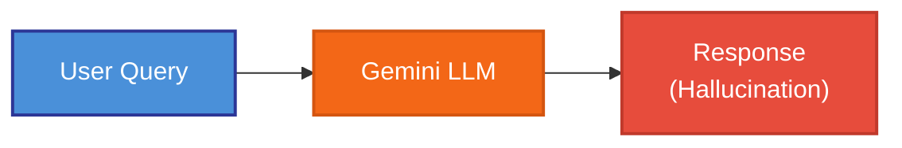
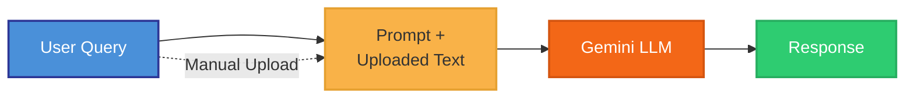
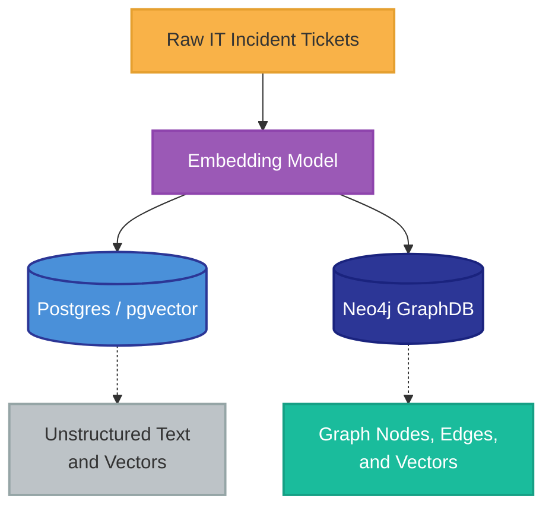
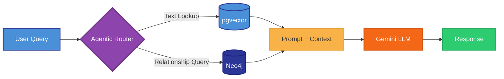
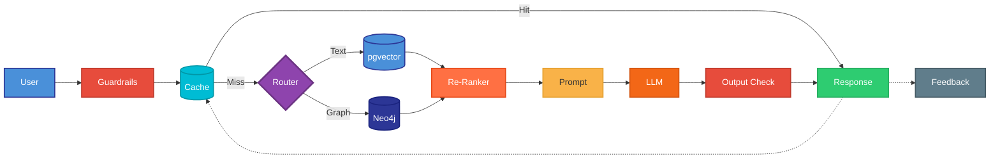

# spring-ai-graphrag-demo
A hands-on, progressive lab using Spring AI. Walk through 5 distinct stages of AI evolution: Simple Chat, In-Context Learning, Vector RAG, Hybrid GraphRAG (Neo4j), and an Intelligent Orchestrator.

## GraphRAG vs Standard RAG Demo

This project is an IT Helpdesk scenario demonstrating the evolution of AI capabilities: from basic AI, to Standard RAG, and finally to GraphRAG with an intelligent orchestrator.

## The 5 Stages of the Presentation

### 1. Baseline AI (No RAG)
- **Controller**: `SimpleAiController.java`
- **Endpoint**: `GET /api/simple`
- **What it does**: Queries the LLM directly without external context.
- **What it misses**: Internal company context.
- **Result**: Hallucinates or says "I don't know".



### 2. In-Context Learning (Prompt Stuffing)
- **Controller**: `InContextLearningController.java`
- **Endpoint**: `POST /api/in-context`
- **What it does**: The user manually uploads text (context) alongside their query.
- **What it misses**: Automated retrieval. The user has to know *exactly* what document to upload beforehand.
- **Result**: Accurate response, but impossible to scale without an automated database search.



---

## The Data Architecture

To understand the difference, it's crucial to understand what data lives where:
- **Postgres (pgvector)**: Stores the **Unstructured Text** of the IT tickets. It embeds the exact descriptions (e.g. "Payment Gateway is timing out for user checkout"). It does *not* know anything about team structures or service dependencies.
- **Neo4j (GraphDB)**: Stores the **Structured Relationships** (Nodes and Edges). It models the dependency chain (`Service-[:DEPENDS_ON]->Service`) and ownership (`Service-[:OWNED_BY]->Team`), and links tickets to the services they affect.



---

### 3. Standard RAG (pgvector)
- **Controller**: `StandardRagController.java`
- **What it does**: Embeds the query and performs a similarity search over isolated text documents (IT incident tickets) using PostgreSQL.
- **When it Works**: `GET /api/rag/error-details` (Retrieving raw text like "What is the exact error message?").
- **When it Fails**: `GET /api/rag/downstream-impact` (Answering multi-hop relationship questions like "Which downstream team do I need to contact?").

```mermaid
flowchart LR
    User["User Query"]:::user --> Embed["Embedding Model"]:::embed
    Embed --> VectorDB[("pgvector DB")]:::postgres
    VectorDB -- "Finds Raw Text" --> Context["Text Context"]:::unstructured
    User --> Prompt["Prompt + Context"]:::prompt
    Context --> Prompt
    Prompt --> LLM["Gemini LLM"]:::llm
    LLM --> Response["Response"]:::success

    classDef user fill:#4A90D9,stroke:#2C3696,color:#fff,stroke-width:2px
    classDef embed fill:#9B59B6,stroke:#8E44AD,color:#fff,stroke-width:2px
    classDef postgres fill:#4A90D9,stroke:#2C3696,color:#fff,stroke-width:2px
    classDef unstructured fill:#BDC3C7,stroke:#95A5A6,color:#333,stroke-width:2px
    classDef prompt fill:#F9B248,stroke:#E5A030,color:#333,stroke-width:2px
    classDef llm fill:#F36717,stroke:#D45510,color:#fff,stroke-width:2px
    classDef success fill:#2ECC71,stroke:#27AE60,color:#fff,stroke-width:2px
```



### 4. Hybrid GraphRAG (Neo4j)
- **Controller**: `GraphRagController.java`
- **What it does**: Uses a vector index on Neo4j to find the starting node, then executes a Cypher graph traversal to pull related Services, Dependencies, Owning Teams, AND the unstructured raw text description.
- **When it Works**: `GET /api/graphrag/downstream-impact` (Traversing the graph to find implicit dependencies) AND `GET /api/graphrag/error-details` (Retrieving raw text). By returning `t.description`, we bridge the gap between unstructured RAG and structured Graph traversal!

```mermaid
flowchart LR
    User["User Query"]:::user --> Embed["Embedding Model"]:::embed
    Embed --> Neo4j[("Neo4j Graph DB")]:::neo4j
    Neo4j -- "1. Vector Search" --> StartNode("Ticket Node"):::ticket
    StartNode -- "2. Graph Traversal" --> RootCause("Root Cause Team"):::team
    StartNode -- "3. Extract Text" --> RawText("Raw Ticket Description"):::unstructured
    RootCause --> Context["Graph Context<br/>+ Raw Text"]:::structured
    RawText --> Context
    User --> Prompt["Prompt + Context"]:::prompt
    Context --> Prompt
    Prompt --> LLM["Gemini LLM"]:::llm
    LLM --> Response["Response"]:::success

    classDef user fill:#4A90D9,stroke:#2C3696,color:#fff,stroke-width:2px
    classDef embed fill:#9B59B6,stroke:#8E44AD,color:#fff,stroke-width:2px
    classDef neo4j fill:#2C3696,stroke:#1A237E,color:#fff,stroke-width:2px
    classDef ticket fill:#F9B248,stroke:#E5A030,color:#333,stroke-width:2px
    classDef team fill:#E67E22,stroke:#D35400,color:#fff,stroke-width:2px
    classDef unstructured fill:#BDC3C7,stroke:#95A5A6,color:#333,stroke-width:2px
    classDef structured fill:#1ABC9C,stroke:#16A085,color:#fff,stroke-width:2px
    classDef prompt fill:#F9B248,stroke:#E5A030,color:#333,stroke-width:2px
    classDef llm fill:#F36717,stroke:#D45510,color:#fff,stroke-width:2px
    classDef success fill:#2ECC71,stroke:#27AE60,color:#fff,stroke-width:2px
```



### 5. Agentic Router (Intelligent Orchestrator)
- **Controller**: `OrchestratorController.java`
- **Endpoint**: `GET /api/orchestrator`
- **What it does**: Uses the LLM itself as a **router** — also known as the **Agentic Router Pattern**. The orchestrator classifies the user's intent and decides whether to delegate the query to Standard RAG (pgvector) or GraphRAG (Neo4j).
- **Why it matters**: This is the production-ready pattern. Instead of forcing the user to pick the right endpoint, the AI makes the routing decision automatically.
- **Key insight**: GraphRAG (Stage 4) and the Agentic Router (Stage 5) are **complementary, not competing**. GraphRAG is a *retrieval strategy* (how you get context). The Agentic Router is an *orchestration pattern* (how you decide which retrieval strategy to use). In production, you combine both.

**Routing Rules:**
| User Intent | Route | Example |
|---|---|---|
| Error messages, stack traces, documentation | `RAG` (pgvector) | "What is the exact error message?" |
| Impact, dependencies, relationships | `GRAPHRAG` (Neo4j) | "Which teams are affected?" |



---

### Production-Grade Architecture: Agentic Router with GraphRAG

The diagram above shows our demo. Below is what a **production-ready** version looks like with the key industry-standard layers.



**What each production layer adds:**

| Layer | Purpose | Tools |
|---|---|---|
| **Guardrails** | PII redaction, prompt injection, compliance | LLM Guard, Presidio |
| **Semantic Cache** | Skip redundant LLM calls for similar queries | Redis, GPTCache |
| **Agentic Router** | Classify intent, pick retrieval strategy | LLM classification |
| **Re-Ranker** | Re-order retrieved chunks by relevance | Cohere Rerank, Cross-Encoders |
| **Output Check** | Hallucination detection, citation | RAGAS, DeepEval |
| **Feedback** | User signal feeds back into cache and tuning | Custom feedback API |

---

**[FAQ: Understanding GraphRAG →](FAQ.md)**

---

## Configuration & Initialization

### The Data Initializer
Upon startup, the application runs a `DataInitializer` (typically a `CommandLineRunner` or `ApplicationRunner`). This component is responsible for:
1. Creating sample IT Helpdesk incident tickets.
2. Generating vector embeddings for the unstructured text of those tickets.
3. Seeding both the Postgres (pgvector) database and the Neo4j (Graph) database with this initial data so the demo is ready to run immediately.

### Vertex AI Properties Clarification
In the `application.properties` file, you will notice two distinct sets of Vertex AI configurations. It is important to understand how they are used:

**1. ChatClient Configuration (Generation)**
```properties
spring.ai.vertex.ai.gemini.project-id=${VERTEX_AI_PROJECT_ID:spring-boot-graphrag}
spring.ai.vertex.ai.gemini.location=${VERTEX_AI_LOCATION:us-central1}
spring.ai.vertex.ai.gemini.chat.options.model=gemini-2.5-flash
```
These properties configure the primary LLM used by the Spring AI `ChatClient`. Whenever a controller needs to generate a human-readable response, summarize text, or analyze context (like in our `SimpleAiController` or `StandardRagController`), it uses these properties to route the request to the `gemini-2.5-flash` model.

**2. Embedding Configuration (Retrieval)**
```properties
spring.ai.vertex.ai.embedding.project-id=${VERTEX_AI_PROJECT_ID:spring-boot-graphrag}
spring.ai.vertex.ai.embedding.location=${VERTEX_AI_LOCATION:us-central1}
```
These properties configure the Spring AI `EmbeddingModel`. For both Standard RAG (pgvector) and GraphRAG (Neo4j), the system must convert the user's raw text query into a numerical vector to perform similarity search. Furthermore, the `DataInitializer` relies heavily on this embedding configuration to generate the initial vector representations of the IT tickets when seeding the databases. Without the embedding model, vector-based similarity search is impossible.

## Running the Demo
1. Start the database infrastructure: `docker-compose up -d`
2. Run the Spring Boot application: `./mvnw spring-boot:run`
3. Execute the endpoints located in `test-requests.http` directly from IntelliJ.
